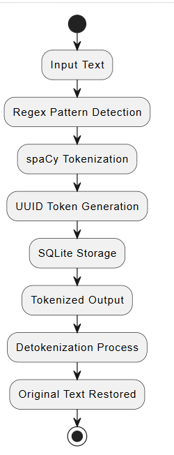
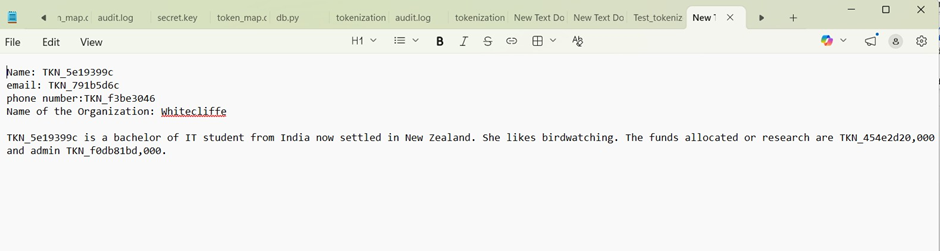
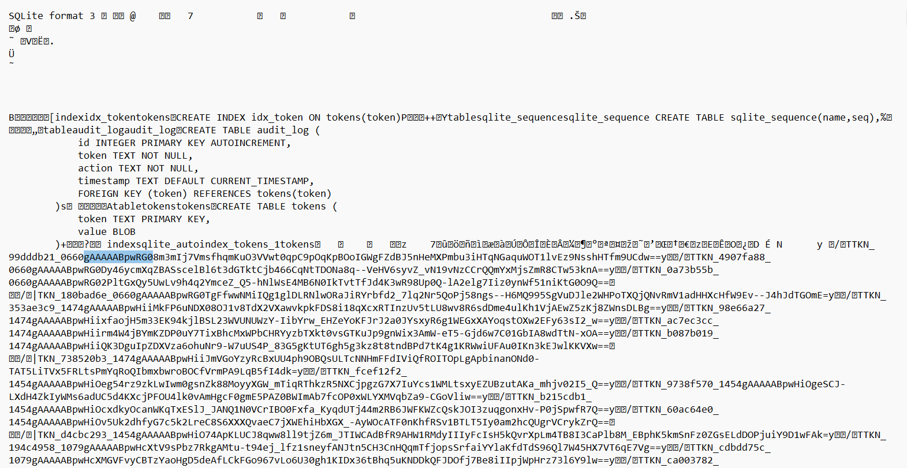
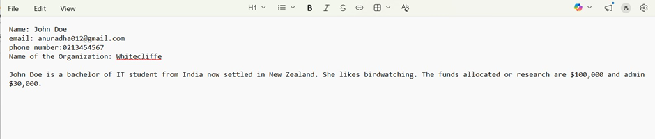

REVERSIBLE TOKENIZATION TOOL

## OVERVIEW
  This project set out to address a significant industry challenge: the secure handling of sensitive data when interacting with the artifical intelligence systems. To mitigate the risk of exposing Personally Identifiable Information (PIIs) and other confidential information like Financial data to external AI platforms, the project designed and implemented a 'Reversible Tokenization Solution' that detects ans tokenizes sensitive data, stores token mappings securely in embedded database and enables controlled detokenization for authorized users.

  The system combines:
  -Regex for structured pattern detection (e.g. emails, phone numbers, credit card numbers, currency )
  -spaCy NLP module for NER (Named Entity Recognition) for detection and tokenization of entities such as names
  -UUIDv4-based token generation for secure and unique identifiers
  -SQLite database for secure persistent token to original mapping

## Key Features
  -Fully reversible Tokenization of sensitive data
  -UUIDv4-based secure token generation
  -Hybrid NLP pipeline (spaCy + Regex)
  -Persistent SQLite mapping storage
  -No <UNK> token usage (no data loss)

## System Architecture
Flowchart
  A[Input Text]--> B[Regex Pattern Detection]
  B--> C[Spacy Tokenization]
  C--> D[UUID Token Generation]
  D--> E[SQLite Storage]
  E--> F[Tokenized output]
  F--> G[Detokenization process]
  G--> H[Original Text restored]

  

  ### Example Usage
    Original Text: John Doe is a bachelor of IT student. The funds allocated are $100,000
    Tokenized Text: TKN_0b6bb4f0  is a bachelor of IT stufdent. The funds allocated are TKN_0cc6786b
    Detokenized (Reconstructed output)Text:  John Doe is a bachelor of IT student. The funds allocated are $100,000

## Screenshots
### Tokenization Process

### SQLite Database Mapping

### Detokenization Output

## Technologies used
  Programming languages: Python and all of its relevant libraries
  Cryptographic Techniques-AES (Fernet)
  spaCy(NLP processing)
  Regex(pattern matching)
  UUIDv4(secure token generation)
  SQLite(Database storage)

## Project Structure
  Reversible Tokenization/
  |
  |--gui.py (handles user interface and main application logic)
  |
  |--pii_tokenizer.py (handles tokenization and detokenization logic)
  |
  |--encryption_utils.py (handles cryptographic functions-turns the sensitive data into cipher text before storing in data base)
  |
  |--db.py (handles database logic)
  |
  |--audit_logger.py (logs the tokenization and detokenization events for traceability and accountability)
  |
  |--README.md
  |
  |--LICENSE
  |
  |--Tests
  |--Screenshots (capturing the core operations like tokenization, detokenization and stored token-value mappings)

## How it Works
  1. Input text is processed using Regex to detect structured sensitive data
  2. spaCy performs linguistic tokenization
  3. Each detected sensitive value is replaced with a unique UUID identifier
  4. The mappings between UUID tokens and original values are stored in SQLite database
  5. During reversal original values are restored through cryptographic tools
  6. The original values are fully restored without loss

## Limitations
  1. Local key storage limitations. No backup or key rotation
  2. Not suitable for multi user environments
  3. Created in Tkinter lacks visual flexibility or responsiveness to screen sizes like that in web frameworks

## Future Improvements
 Include:
  1.  Extending the system to a client-server or web-based architecture 
  2.  Integrate external "Key Management Services" or Hardware Security Modules (HSMs), key rotation mechanisms
  3.  More advanced GUI frameworks for better visual flexibility and user-experience

## Author
  Anuradha Mangalpalli
  Bachelor of Applied Information Technology student
  Whitecliffe

  Reversible Tokenization Tool-AI
  Developed for Academic Research 

 

  

